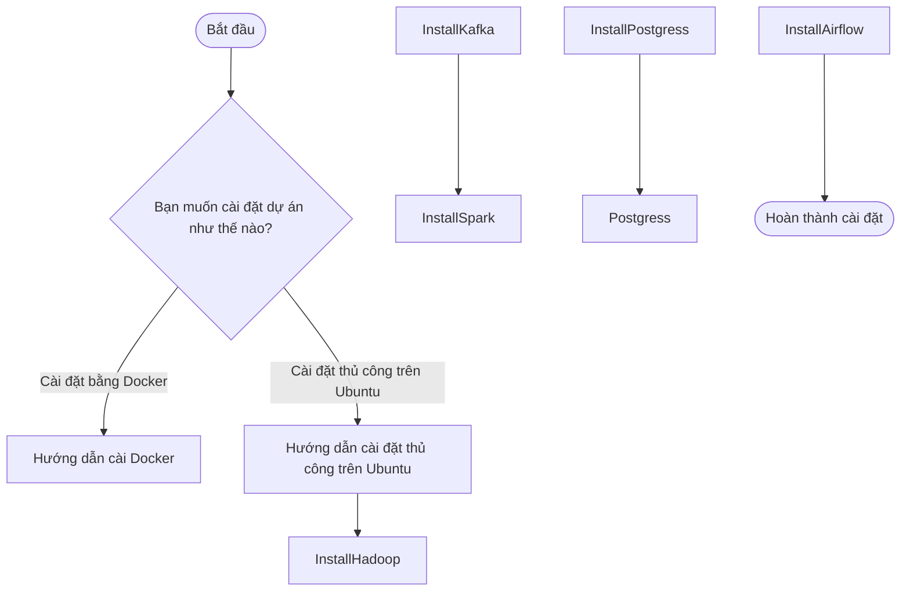

# Pipeline cho hệ thống tìm kiếm và phân tích các doanh nghiệp ở bảng Washington
## Tổng quan
- Dự án tập trung xây dựng một hệ thống kỹ thuật dữ liệu hiện đại, hỗ trợ thu thập, lưu trữ, xử lý và phân tích dữ liệu review và meta của doanh nghiệp qua các năm, nhằm góp phần ra quyết định của người dùng.

- Pipeline dữ liệu được tự động hóa toàn diện, ứng dụng các công nghệ Big Data tiên tiến như Apache Hadoop, Spark, Spark NLP và cơ sở dữ liệu phân tán, đảm bảo khả năng xử lý dữ liệu lớn hiệu quả, linh hoạt và có thể mở rộng theo thời gian thực.

- Nguồn dữ liệu: [Google Local Reviews (2021)](https://mcauleylab.ucsd.edu/public_datasets/gdrive/googlelocal/)

- Đây là bộ dữ liệu Google Local Reviews (2021), được thu thập và công
bố bởi nhóm nghiên cứu thuộc Đại học California, San Diego (UCSD). Đây là một trong
những tập dữ liệu học thuật lớn nhất và phong phú nhất về thông tin địa điểm và đánh giá của người dùng trên nền tảng Google Maps tại Hoa Kỳ.

----
## Cấu trúc thư mục

Gồm hai phần gồm cấu trúc thư mục thực hiện luồng xử lý dữ liệu và cấu trúc thư mục thực hiện cho việc deploy sản phẩm:

```
├───images
├───preprocessing_data
├───source
│   ├───jobs
│   ├───modules
│   ├───schemas
│   ├───sql
│   └───utils
└───washington-recsys-backend
    ├───app
    │   ├───api
    │   │   └───routers
    │   ├───db
    │   ├───models
    │   ├───repositories
    │   ├───schemas
    │   └───services
    └───washington-frontend
        ├───public
        └───src
```
---
## Kiến trúc pipeline

<p align="center">
  
</p>

---

## Quy Trình Xử Lý Dữ Liệu
1. Thu thập dữ liệu và lưu trữ dữ liệu thô
- Dữ liệu lấy trực tiếp từ [link](https://mcauleylab.ucsd.edu/public_datasets/gdrive/googlelocal/) sẽ bao gồm hai file `review.json` và `metadata.json`. Dữ liệu sau khi tải về được lưu dưới dạng tệp JSON trong hệ thống tệp cục bộ. Đây là nguồn dữ liệu thô ban đầu phục vụ cho các bước xử lý tiếp theo.
2. Nạp Dữ Liệu Vào Data Lake (HDFS)
- Các tệp JSON sẽ được chuyển vào hệ thống Data Lake dựa trên nền tảng HDFS. Điều này cho phép lưu trữ dữ liệu khối lượng lớn, hỗ trợ khả năng truy xuất và xử lý phân tán hiệu quả.
3. ETL Cơ Bản và xử Lý Nâng Cao 
- Sau khi lưu trữ vào HDFS, hệ thống sử dụng Kafka để kích hoạt chuỗi xử lý ETL. Bao gồm:

    - Extract: Đọc dữ liệu từ HDFS.
    - Transform: Làm sạch, chuẩn hóa, xử lý định dạng dữ liệu (chuyển đổi kiểu dữ liệu, tách thể loại, chuẩn hóa thời gian,...).
    - Load: Lưu lại dữ liệu đã xử lý vào một thư mục HDFS mới 
- Apache Spark được tích hợp để xử lý nâng cao dữ liệu, ví dụ:
    - Lọc và phân loại review theo điểm đánh giá
    - Phân tích doanh nghiệp dựa vào các review và thời gian\
    - Sentiment text rivew, classification group category.
    - Tạo các bảng tổng hợp phục vụ phân tích

### ETL Metadata

> Overview 

<p align="center">
  
</p>

> Silver layer
<p align="center">
  
</p>

> Gold layer

<p align="center">
  
</p>


### ETL Reviews

> Overview 

<p align="center">
  
</p>

> Silver layer
<p align="center">
  
</p>

> Gold layer

<p align="center">
  
</p>


-----

## ERD For Database


<p align="center">
  
</p>

# Hướng Dẫn Cài Đặt Dự Án

Để hiểu rõ hơn về cách hoạt động và vận hành của các công cụ, cung như luồng hoạt động mình sẽ đề xuất việc cài đặt các công cụ thủ công trên Ubuntu. Bạn cũng có thể dùng docker cho dự dán để tự động hóa và đóng gói nếu cần.

```bash
# Clone project từ GitHub về máy
git clone https://github.com/ptai21/Project_Big_Data.git
```

```bash
# Điều hướng vào thư mục project
cd <tên-thư-mục-project>
```

Tải các thư viện cần thiết trong folder **requirements**



### 1. Cài Đặt Hadoop Trên Ubuntu
```bash
# 1. Cài Java 11
sudo apt update
sudo apt install openjdk-11-jdk -y

# Kiểm tra:
java -version
javac -version
which javac
readlink -f /usr/bin/javac
# Ghi nhớ JAVA_HOME: /usr/lib/jvm/java-11-openjdk-amd64/
```
Download Hadoop using wget
```bash
# 2. Tải Hadoop
# Truy cập https://hadoop.apache.org/releases.html, tải bản mới nhất (vd: hadoop-3.4.1)
cd ~
wget https://dlcdn.apache.org/hadoop/common/hadoop-3.4.1/hadoop-3.4.1.tar.gz
tar -xvzf hadoop-3.4.1.tar.gz
mv hadoop-3.4.1 ~/hadoop-3.4.1
```

```bash
# 3. Cài SSH
sudo apt install openssh-server openssh-client -y
ssh-keygen -t rsa -P '' -f ~/.ssh/id_rsa
cat ~/.ssh/id_rsa.pub >> ~/.ssh/authorized_keys
chmod 0600 ~/.ssh/authorized_keys
ssh localhost
```

```bash
# 4. Thiết lập biến môi trường
vi ~/.bashrc
# Hadoop Environment Variables
export HADOOP_HOME=/usr/local/hadoop
export HADOOP_INSTALL=$HADOOP_HOME
export HADOOP_MAPRED_HOME=$HADOOP_HOME
export HADOOP_COMMON_HOME=$HADOOP_HOME
export HADOOP_HDFS_HOME=$HADOOP_HOME
export YARN_HOME=$HADOOP_HOME
export HADOOP_COMMON_LIB_NATIVE_DIR=$HADOOP_HOME/lib/native
export PATH=$PATH:$HADOOP_HOME/sbin:$HADOOP_HOME/bin
export HADOOP_OPTS="-Djava.library.path=$HADOOP_HOME/lib/native"
export JAVA_HOME=$(dirname $(dirname $(readlink -f $(which java))))
export PATH=$PATH:$JAVA_HOME/bin
# Lưu file rồi chạy:
source ~/.bashrc
```

```bash
# 5. Cấu hình Hadoop

# 5.1 Cấu hình JAVA_HOME trong hadoop-env.sh
mkdir -p $HADOOP_HOME/hdfs/namenode
mkdir -p $HADOOP_HOME/hdfs/datanode
vi $HADOOP_HOME/etc/hadoop/hadoop-env.sh
# Sửa dòng:
export JAVA_HOME=/usr/lib/jvm/java-11-openjdk-amd64
```

```bash
# 5.2 core-site.xml
mkdir -p ~/hadoop-3.4.1/tmp
nano ~/hadoop/etc/hadoop/core-site.xml
```
```xml
<configuration>
    <property>
        <name>fs.defaultFS</name>
        <value>hdfs://localhost:9000</value>
    </property>

    <property>
        <name>hadoop.tmp.dir</name>
        <value>/home/thka02415/hadoop/tmp</value>
    </property>
</configuration>
```

```bash
# 5.3 mapred-site.xml
cp ~/hadoop-3.4.1/etc/hadoop/mapred-site.xml.template ~/hadoop-3.4.1/etc/hadoop/mapred-site.xml
nano ~/hadoop/etc/hadoop/mapred-site.xml
```
Thêm:
```xml
    <property>
        <name>mapreduce.framework.name</name>
        <value>yarn</value>
    </property>

    <property>
        <name>yarn.app.mapreduce.am.env</name>
        <value>HADOOP_MAPRED_HOME=/home/thka02415/hadoop</value>
    </property>

    <property>
        <name>mapreduce.map.env</name>
        <value>HADOOP_MAPRED_HOME=/home/thka02415/hadoop</value>
    </property>

    <property>
        <name>mapreduce.reduce.env</name>
        <value>HADOOP_MAPRED_HOME=/home/thka02415/hadoop</value>
    </property>
```

```bash
# 5.4 hdfs-site.xml
nano ~/hadoop/etc/hadoop/hdfs-site.xml
```
Thêm:
```xml
<property>
    <name>dfs.replication</name>
    <value>1</value>
</property>

<property>
    <name>dfs.namenode.name.dir</name>
    <value>/home/thka02415/hadoop/data/namenode</value>
</property>

<property>
    <name>dfs.datanode.data.dir</name>
    <value>/home/thka02415/hadoop/data/datanode</value>
</property>
```

```bash
# 5.5 yarn-site.xml
nano ~/hadoop/etc/hadoop/yarn-site.xml
```
Thêm:
```xml
  <property>
      <name>yarn.nodemanager.aux-services</name>
      <value>mapreduce_shuffle</value>
  </property>

  <property>
      <name>yarn.nodemanager.env-whitelist</name>
      <value>JAVA_HOME,HADOOP_COMMON_HOME,HADOOP_HDFS_HOME,HADOOP_CONF_DIR,CLASSPATH_PREPEND_DISTCACHE,HADOOP_YARN_HOME,HADOOP_MAPRED_HOME</value>
  </property>

  <property>
      <name>yarn.resourcemanager.hostname</name>
      <value>localhost</value>
  </property>

  <property>
      <name>yarn.resourcemanager.webapp.address</name>
      <value>0.0.0.0:8088</value>
  </property>
```

```bash
# 6. Format hệ thống Hadoop
cd ~
hdfs namenode -format
```

```bash
# 7. Khởi chạy Hadoop
start-dfs.sh
start-yarn.sh
```

```bash
# 8. Kiểm tra tiến trình
jps
# Kết quả cần có: NameNode, DataNode, SecondaryNameNode, ResourceManager, NodeManager, Jps
```


### 2. Cài Đặt Apache Spark Trên Ubuntu

```bash
# 1. Tải Spark 3.5.5
wget https://dlcdn.apache.org/spark/spark-3.5.5/spark-3.5.5-bin-hadoop3.tgz
```

```bash
# 2. Giải nén và di chuyển Spark vào /opt/spark
tar -xvzf spark-3.5.5-bin-hadoop3.tgz
sudo mv spark-3.5.5-bin-hadoop3 /opt/spark
```

```bash
# 3. Cấu hình biến môi trường
nano ~/.bashrc
```

Thêm các dòng sau vào cuối file `~/.bashrc`:
```bash
export SPARK_HOME=/opt/spark
export PATH=$SPARK_HOME/bin:$PATH
export PYSPARK_PYTHON=python3
```

```bash
# Lưu file và áp dụng thay đổi
source ~/.bashrc
```

```bash
# 4. Khởi động Spark
pyspark
```

- Truy cập cổng sau để xem giao diện người dùng (UI):  
  [http://localhost:4040](http://localhost:4040)

-------


